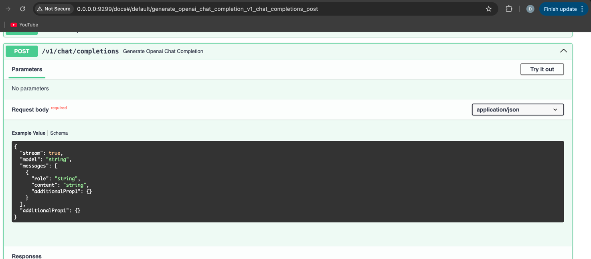
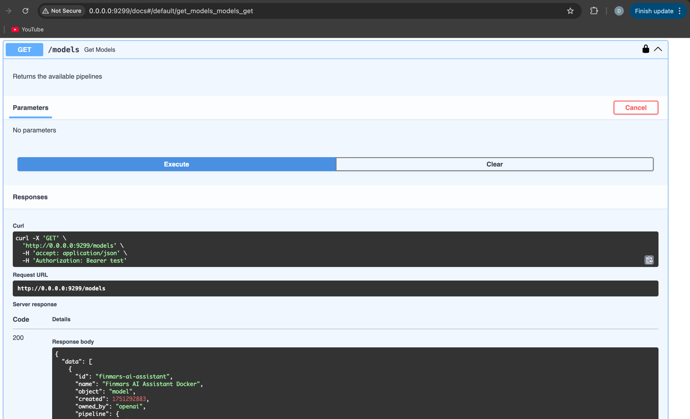

# Finmars AI Assistant

An intelligent AI assistant system for portfolio management using cutting-edge agent architectures and modular components.

## Architecture Overview

### 1. Chat Interface - Open WebUI
We utilize [Open WebUI](https://github.com/open-webui/open-webui) as our chat interface platform. Open WebUI is an extensible, feature-rich, and user-friendly self-hosted AI platform that offers:
- Support for Ollama and OpenAI-compatible APIs
- Built-in RAG (Retrieval Augmented Generation) capabilities
- Granular user permissions and access control
- Responsive design with mobile support
- Plugin framework for custom logic
- Web search and browsing integration

### 2. Pipeline Modules - Open WebUI Pipelines
[Open WebUI Pipelines](https://github.com/open-webui/pipelines) provides the capability to build modular agent logic. This framework allows us to:
- Create customizable Python-based workflows
- Build dynamic AI multi-agent behaviors
- Integrate complex business logic
- Support computationally heavy tasks
- Enable function calling and custom RAG implementations

Pipelines is a **FastAPI application** with a fully **OpenAI-compatible API interface**. This means:
- All API endpoints follow the OpenAI API specification
- Any OpenAI client can be made compatible with our agent API by simply replacing the `base_url`
- Seamless integration with existing OpenAI SDK implementations
- Standard request/response formats for chat completions, embeddings, and other endpoints

#### Agent Pipelines Service
The project includes an `agent-pipelines` service in Docker Compose that:
- Runs as a FastAPI application on port 9299
- Provides OpenAI-compatible API endpoints
- Includes Swagger documentation at http://localhost:9299/docs
- Main endpoint: `/v1/chat/completions` for chat interactions
- Integrates with Langfuse for observability
- Connects to Open WebUI for a seamless chat interface






### 3. Agent Architecture
Agents are implemented using:
- **LangGraph** with ReAct pattern as the primary framework
- **AutoGen** as an alternative agent framework

#### Simple ReAct Agent Architecture as First Step (LangGraph)
The ReAct (Reasoning and Acting) agent follows this workflow:

```
┌─────────────────┐
│   User Input    │
└────────┬────────┘
         │
         ▼
┌─────────────────┐
│   LLM Reasoning │◄──────┐
└────────┬────────┘       │
         │                │
         ▼                │
┌─────────────────┐       │
│ Tool Selection? │       │
└────┬──────┬─────┘       │
     │      │             │
  No │      │ Yes         │
     │      │             │
     ▼      ▼             │
┌────────┐ ┌─────────────┐│
│Response│ │Tool Execution││
└────────┘ └──────┬───────┘│
              │            │
              └────────────┘
```

The agent:
1. Receives user input
2. Uses LLM to reason about the task
3. Decides whether to use tools or respond
4. If tools are needed, executes them
5. Adds results back to context
6. Loops until task completion

### 4. Tool Infrastructure
Tools are accessible through:
- **LangChain** tooling ecosystem for LangGraph agents
- **AutoGen adapter** ([autogen_ext.tools.langchain](https://microsoft.github.io/autogen/stable//reference/python/autogen_ext.tools.langchain.html#module-autogen_ext.tools.langchain)) for AutoGen agents

This allows seamless tool integration across both agent frameworks.

#### 4.1 Tool Implementation Pattern
Each tool follows a three-step pattern:
1. **Pre-process**: LLM-based input (tool call) preparation and validation
2. **API Request**: Calls to [Finmars Portfolio API](https://api-docs.finmars.com/portfolio.html)
3. **Post-process**: Format results into LLM-optimized strings

#### 4.2 Pydantic Models Architecture
The project uses two distinct types of Pydantic models:

##### API Payload Models (`libs/schema/`)
- **Purpose**: Define the exact structure for API requests/responses
- **Location**: `libs/schema/` directory
- **Characteristics**:
  - Auto-generated from OpenAPI specification using `datamodel-codegen`
  - Strict validation constraints (string lengths, numeric ranges, formats)
  - Optional fields for flexible API operations
  - View models for read operations
  - Light models for minimal representations
- **Examples**: `Portfolio`, `PortfolioType`, `PortfolioHistory`, `GenericAttribute`

The main schema files include:
- `base.py` - Base enums and types (SourceTypeEnum, StatusEnum, etc.)
- `responses.py` - Paginated response models for API endpoints
- `via_data_model_codegen/portfolio_schema.py` - Auto-generated models from OpenAPI spec

##### Tool-Calling Input Schemas
- **Purpose**: Define input structures for LLM tool calls
- **Characteristics**:
  - Simplified schemas focused on LLM-friendly inputs
  - May have different field names and structures than API models
  - Related but not inherited from API models
  - Optimized for natural language understanding
  - Flexible validation for conversational inputs
- **Relationship**: These schemas act as adapters between LLM-generated parameters and API payload models

This separation allows for:
- LLM-optimized tool interfaces without API constraints
- Independent evolution of tool calling schemas
- Clear boundary between AI interaction layer and API layer

#### 4.3 Future Extensions
- MCP Server implementation for comprehensive tool sharing capabilities

### 5. Observability - Langfuse (Optional)
[Langfuse](https://github.com/langfuse/langfuse) provides comprehensive observability when configured:
- **Trace Tracking**: Monitor all agent execution steps
- **Prompt Management**: Version control and collaborative iteration on prompts
- **Evaluations**: LLM-as-a-judge and custom evaluation pipelines
- **Datasets**: Test sets and benchmarks for continuous improvement
- **LLM Playground**: Testing and iteration environment

**Note**: Langfuse integration is now optional. The system will automatically detect if Langfuse environment variables are configured and enable observability features accordingly

#### Langfuse Integration Details (When Configured)

The project integrates Langfuse at multiple levels when the required environment variables are set:

1. **Prompt Management (`libs/utils/langfuse_manager.py`)**:
   - Automatic prompt versioning with labels
   - Prompt creation if not found in Langfuse
   - Message format mapping between LangChain and Langfuse
   - Centralized prompt retrieval for consistency

2. **Agent Tracing** (when Langfuse is configured):
   - All agent executions are automatically traced
   - Metadata support (user_id, session_id, tags)
   - Tool call tracking and performance monitoring
   - Error tracking and debugging capabilities
   - Automatically disabled if Langfuse environment variables are not set

3. **Docker Compose Deployment Options**:
   - **docker-compose-core.yaml**: Minimal setup with just Open WebUI and Agent Pipelines
   - **docker-compose.yaml**: Full stack including Langfuse observability:
     - PostgreSQL for data persistence
     - ClickHouse for analytics
     - MinIO for object storage
     - Redis for caching

4. **Usage in Code**:
   ```python
   from libs.utils.langfuse_callback import get_langfuse_callbacks
   
   # Automatically detects if Langfuse is configured
   callbacks = get_langfuse_callbacks()
   
   # Use with agent - callbacks will be empty list if Langfuse not configured
   response = await agent.ainvoke(
       {\"messages\": [HumanMessage(content=\"Your query\")]},
       config={\"callbacks\": callbacks}
   )
   ```
   
   The system automatically checks for Langfuse environment variables and only enables callbacks when properly configured

### 5.1. Prompt Management System

The project supports flexible prompt management with the ability to load prompts from either local code or Langfuse:

#### Prompt Suggestions System

The project includes a pre-configured prompt suggestions system (`libs/openwebui_utils/prompt-suggestions.json`) that enhances the user experience in Open WebUI with intelligent query recommendations:

**Example Prompts**:
- "What companies are in portfolio XYZ?"
- "Show me the P&L for portfolio ABC"
- "List all transactions in the last month"
- "What's the current allocation of portfolio DEF?"
- "Check if there are any short positions"

These prompts are automatically suggested to users in the Open WebUI interface, making it easier to discover agent capabilities.

#### Configuration Options

1. **Environment Variable** (Recommended):
   ```bash
   # Use prompts from local code (default)
   export PROMPT_SOURCE=code
   
   # Use prompts from Langfuse
   export PROMPT_SOURCE=langfuse
   ```

2. **Programmatic Usage**:
   ```python
   from libs.utils.langfuse_manager import PromptSource
   from agents.react_agent.runner import run_agent
   
   # Use local prompts
   response = await run_agent(messages, prompt_source=PromptSource.CODE)
   
   # Use Langfuse prompts
   response = await run_agent(messages, prompt_source=PromptSource.LANGFUSE)
   ```

#### Benefits

- **Development Flexibility**: Use local prompts during development for rapid iteration
- **Production Control**: Manage prompts in Langfuse for A/B testing and versioning
- **Zero Code Changes**: Switch between sources using environment variables
- **Automatic Sync**: If a prompt doesn't exist in Langfuse, it's automatically created from code

## Current Implementation Status

### ✅ Phase 1: Core Infrastructure (Completed)
- **Finmars API Client Library** - Fully async Python client with type safety
- **Schema Generation** - Auto-generated Pydantic models from OpenAPI specification
- **CLI Interface** - Command-line tools for API interaction and testing
- **Comprehensive Testing** - Test suite for all client components

### ✅ Phase 2: Agent Implementation (Completed)
- **ReAct Agent** implemented using LangGraph with full reasoning and tool-calling capabilities
- **Langfuse Integration** for prompt management and observability
- **8 Comprehensive Toolkits** for portfolio operations and reporting
- **Async Runner** with metadata support for tracing

```bash
# Simple Fast Run the ReAct agent
python agents/react_agent/runner.py
```

### ✅ Phase 3: Observability Setup (Completed)
- **Langfuse** fully integrated with Docker Compose deployment
- **Prompt Management** system with versioning and automatic prompt creation
- **Trace Tracking** enabled for all agent executions
- **Callback Handlers** integrated into the ReAct agent

### ✅ Phase 4: Pipeline Integration (Completed)
- **Agent Pipelines Service** deployed as FastAPI application with OpenAI-compatible API
- **Pipeline endpoints** configured at `/v1/chat/completions`
- **Swagger documentation** available at http://localhost:9299/docs
- **Integration with Langfuse** for observability and tracing
- **Full compatibility** with OpenAI SDK and LangChain

### ✅ Phase 5: UI Deployment (Completed)
- **Open WebUI** deployed with Docker Compose on port 8881
- **Agent Pipelines** connected to chat interface
- **Chat-based interactions** fully functional with streaming support
- **Prompt Suggestions System** with pre-configured queries for common tasks
- **Enhanced user experience** with intelligent prompt recommendations

## Tools Implementation

The project includes 8 comprehensive toolkits that provide the ReAct agent with full access to Finmars Portfolio API and reporting capabilities:

### 1. Portfolio Toolkit (`tools/portfolio_toolkit.py`)
- **list_portfolios**: Search and filter portfolios with pagination
- **get_portfolio**: Retrieve detailed portfolio information
- **list_portfolios_light**: Get minimal portfolio representations
- **list_portfolio_attributes**: Access portfolio custom attributes
- **get_inception_date**: Retrieve portfolio inception dates
- **list_first_transaction_dates**: Get first transaction dates by portfolio type

### 2. Portfolio Type Toolkit (`tools/portfolio_type_toolkit.py`)
- **list_portfolio_types**: Browse available portfolio types
- **get_portfolio_type**: Get detailed portfolio type configuration
- **list_portfolio_types_light**: Minimal portfolio type listings
- **list_portfolio_attribute_types**: Discover available attribute types
- **get_portfolio_type_attributes**: Get type-specific attribute definitions

### 3. Portfolio Register Toolkit (`tools/portfolio_register_toolkit.py`)
- **list_portfolio_registers**: Browse portfolio registers
- **get_portfolio_register**: Access specific register details
- **list_portfolio_register_records**: Query register records with filtering
- **get_portfolio_register_record**: Retrieve individual record details

### 4. Portfolio History Toolkit (`tools/portfolio_history_toolkit.py`)
- **list_portfolio_history**: Access historical portfolio data
- **get_portfolio_history**: Retrieve specific history records

### 5. Portfolio Reconcile Toolkit (`tools/portfolio_reconcile_toolkit.py`)
- **list_portfolio_reconcile_groups**: Browse reconciliation groups
- **get_portfolio_reconcile_group**: Access group configurations
- **list_portfolio_reconcile_history**: Query reconciliation history
- **list_portfolio_reconcile_status**: Check current reconciliation status

### 6. Balance Report Toolkit (`tools/balance_report_toolkit.py`)
- **get_balance_report**: Retrieve portfolio holdings and positions
- **analyze_allocations**: Get asset allocation and exposure analysis
- **get_market_values**: Calculate current market values and weights
- **get_bond_metrics**: Access YTM, duration, and other bond analytics
- **check_short_positions**: Identify and analyze short positions

### 7. P&L Report Toolkit (`tools/pl_report_toolkit.py`)
- **get_pl_report**: Comprehensive profit & loss analysis
- **analyze_performance**: Calculate returns and performance metrics
- **get_realized_gains**: Track realized gains and losses
- **get_unrealized_gains**: Monitor unrealized P&L positions
- **calculate_carry_pl**: Analyze carry and overhead components

### 8. Transaction Report Toolkit (`tools/transaction_report_toolkit.py`)
- **list_transactions**: Query transaction history with filters
- **get_transaction_details**: Retrieve specific transaction information
- **export_transactions**: Export transaction data for analysis
- **analyze_trading_activity**: Summary of buy/sell activities
- **get_recent_transactions**: Quick access to latest transactions

### Tool Architecture
Each toolkit follows a consistent implementation pattern:
- **LLM-Optimized Input Schemas**: Separate from API models for better agent interaction
- **Async Operations**: All tools use async/await for efficient execution
- **Structured Output**: JSON-formatted responses for agent consumption
- **Error Handling**: Graceful error management with informative messages

## Getting Started

### Prerequisites
- Python 3.12+
- Docker and Docker Compose
- API access to Finmars Portfolio service
- OpenAI API key (or compatible LLM provider)

### Installation
```bash
# Clone the repository
git clone remote-repo-address/finmars-ai-assistant.git
cd finmars-ai-assistant

# Install dependencies
pip install -r requirements.txt

# Set up environment variables
cp .env.example .env
# Edit .env with your API keys and configuration
```

### Configuration

#### Required Environment Variables
```bash
# Finmars API Configuration
export FINMARS_EXPERT_TOKEN='your-api-token'
export FINMARS_BASE_URL='https://api.finmars.com'
export FINMARS_REALM='your-realm'
export FINMARS_SPACE='your-space'

# LLM Provider (OpenAI or compatible)
export OPENAI_API_KEY='your-openai-key'
export OPENAI_BASE_URL='https://api.openai.com/v1'  # Optional, for custom endpoints

# Langfuse Observability (optional)
# If these variables are not set, the system will run without Langfuse integration
export LANGFUSE_PUBLIC_KEY='your-public-key'  # Optional
export LANGFUSE_SECRET_KEY='your-secret-key'  # Optional
export LANGFUSE_HOST='http://localhost:3000'  # Optional, or your Langfuse URL

# Prompt Source Configuration
# Options: "code" (use local prompts) or "langfuse" (use Langfuse prompts)
# Default: "code"
export PROMPT_SOURCE='code'

# Open WebUI Pipelines (for future integration)
export PIPELINES_API_KEY='your-pipelines-key'
```

### Docker Compose Setup

The project includes two Docker Compose configurations:

#### Option 1: Core Services Only (without Langfuse)
```bash
# Start core services only (Open WebUI, Agent Pipelines)
docker-compose -f docker-compose-core.yaml up -d
```

#### Option 2: Full Stack with Observability (with Langfuse)
```bash
# Start all services including Langfuse observability stack
docker-compose up -d

# Check service status
docker-compose ps

# View logs
docker-compose logs -f

# Stop all services
docker-compose down
```

#### Available Services:

**Core Services (always available):**
- **Open WebUI**: http://localhost:8881 - Chat interface for interacting with agents
- **Agent Pipelines**: http://localhost:9299 - FastAPI service providing OpenAI-compatible API
  - Swagger docs: http://localhost:9299/docs
  - Chat completions endpoint to make requests to Finmars Agent: `/v1/chat/completions`

**Observability Services (with full docker-compose.yaml only):**
- **Langfuse**: http://localhost:3000 - Observability and prompt management
- **PostgreSQL**: Port 5432 - Database for Langfuse
- **ClickHouse**: Port 8123 - Analytics database for Langfuse
- **MinIO**: Port 9001 - Object storage for Langfuse
- **Redis**: Port 6379 - Caching layer

### Quick Start

For detailed development setup instructions, see [SETUP_DEVELOPMENT.md](SETUP_DEVELOPMENT.md).

1. **Set up environment**:
   ```bash
   cp .env.example .env
   # Edit .env with your credentials
   ```

2. **Start Docker services**:
   ```bash
   # Option A: Core services only (without Langfuse)
   docker-compose -f docker-compose-core.yaml up -d
   
   # Option B: Full stack with Langfuse observability
   docker-compose up -d
   ```

3. **Run the ReAct agent**:
   ```bash
   python agents/react_agent/runner.py
   ```

4. **Use the CLI for direct API access**:
   ```bash
   python cli/main.py list-portfolios --page 1 --page-size 10
   ```

5. **Interact with agent via LangChain API** (OpenAI-compatible):
   ```bash
   python scripts/interact_to_agent_via_api.py
   ```

## Project Structure
```
finmars-ai-assistant/
├── README.md
├── docker-compose.yaml              # Full stack with Langfuse observability
├── docker-compose-core.yaml         # Core services only (without Langfuse)
├── .env.example                     # Environment variables template
├── requirements.txt                 # Python dependencies
├── libs/
│   ├── client/                      # Finmars API Client Library
│   │   ├── __init__.py              # Client exports
│   │   ├── base.py                  # Base HTTP client with async support
│   │   ├── finmars_client.py        # Main client aggregating all sub-clients
│   │   ├── portfolio.py             # Portfolio operations client
│   │   ├── portfolio_type.py        # Portfolio type operations client
│   │   ├── portfolio_register.py    # Portfolio register operations client
│   │   ├── portfolio_history.py     # Portfolio history operations client
│   │   ├── portfolio_reconcile.py   # Portfolio reconciliation client
│   │   ├── balance_report.py        # Balance report client
│   │   ├── pl_report.py             # P&L report client
│   │   ├── transaction_report.py    # Transaction report client
│   │   ├── price_history_check.py   # Price history validation client
│   │   └── tests/                   # Test suite for client library
│   │       ├── test_base.py         # Base client tests
│   │       ├── test_finmars_client.py # Main client tests
│   │       ├── test_portfolio.py    # Portfolio client tests
│   │       └── test_portfolio_type.py # Portfolio type tests
│   ├── openapi/
│   │   ├── portfolio/
│   │   │   ├── openapi.json         # Local portfolio API specification
│   │   │   └── openapi_remote.json  # Remote portfolio API specification
│   │   └── report/
│   │       └── openapi_v3.json      # Report API specification
│   ├── openwebui_utils/             # Open WebUI integration utilities
│   │   └── prompt-suggestions.json  # Pre-configured prompt suggestions
│   ├── schema/                      # Pydantic models for API payloads
│   │   ├── __init__.py              # Schema exports
│   │   ├── base.py                  # Base enums and common types
│   │   ├── responses.py             # Paginated response models
│   │   ├── README.md                # Schema generation documentation
│   │   └── via_data_model_codegen/  # Auto-generated models
│   │       ├── __init__.py          # Generated schema exports
│   │       ├── portfolio_schema.py  # Complete portfolio API models
│   │       └── report_schema.py     # Complete report API models
│   ├── basic/                       # Basic utilities
│   │   └── base_enum.py             # Base enum with string representation
│   ├── logger/                      # Logging configuration
│   │   └── logger.py                # Custom logger setup
│   └── utils/                       # Utility modules
│       ├── key_manager.py           # API key management
│       ├── langfuse_manager.py      # Langfuse prompt management
│       ├── langfuse_callback.py     # Optional Langfuse callback handler
│       └── prompt_map_builder.py    # Prompt configuration builder
├── cli/                             # Command-line interface
│   ├── __init__.py                  # CLI exports
│   ├── main.py                      # Main CLI application
│   ├── examples.py                  # Usage examples and demos
│   └── README.md                    # CLI documentation
├── agents/                          # Agent implementations
│   └── react_agent/                 # ReAct agent using LangGraph
│       ├── __init__.py              # Agent exports
│       ├── agent_react_builder.py   # ReAct agent builder with Langfuse
│       ├── runner.py                # Async agent runner with tracing
│       └── system_prompt.py         # System prompt configuration
├── tools/                           # Tool implementations with LangChain
│   ├── __init__.py                  # Tool exports and registry
│   ├── portfolio_toolkit.py         # Portfolio management tools
│   ├── portfolio_type_toolkit.py    # Portfolio type tools
│   ├── portfolio_register_toolkit.py # Portfolio register tools
│   ├── portfolio_history_toolkit.py # Portfolio history tools
│   ├── portfolio_reconcile_toolkit.py # Portfolio reconciliation tools
│   ├── balance_report_toolkit.py   # Balance and holdings report tools
│   ├── pl_report_toolkit.py        # P&L analysis and performance tools
│   └── transaction_report_toolkit.py # Transaction history tools
├── pipelines/                       # Open WebUI pipeline modules
│   └── finmars-ai-assistant.py     # Main pipeline implementation
├── utils/                           # Utility modules
│   ├── __init__.py                  # Utils exports  
│   ├── agent_utils/                 # Agent utility functions
│   │   ├── __init__.py              # Agent utils exports
│   │   ├── async_loop_to_sync.py   # Async to sync converter
│   │   └── lc_converter.py         # LangChain converter utilities
│   └── pipelines/                   # Pipeline utility modules
│       ├── __init__.py              # Pipeline utils exports
│       ├── auth.py                  # Authentication utilities
│       ├── main.py                  # Main pipeline utilities
│       └── misc.py                  # Miscellaneous utilities
├── scripts/                         # Utility scripts and examples
│   ├── __init__.py                  # Scripts exports
│   ├── interact_to_agent_via_api.py # Interactive API client
│   ├── test_single_query.py        # Single query testing
│   ├── GENERATE_QUERIE.md          # Query generation guide
│   ├── TO_UPDATE_AGENT_QUERIES_AND_RESULTS.md # Update guide
│   ├── helper_agent_task_prompt.md # Agent task prompts
│   └── examples_of_queries/        # Query examples
│       ├── AGENT_QUERIES_AND_RESULTS.md # Agent query examples
│       └── PL_TOOLKIT_QUERIES.md   # P&L toolkit queries
├── docs/                            # Documentation assets
│   ├── img.png                      # Architecture diagrams
│   ├── img_1.png                    # UI screenshots
│   ├── img_2.png                    # Pipeline screenshots
│   └── img_3.png                    # Additional visuals
└── SETUP_DEVELOPMENT.md             # Development environment setup guide
```

## Finmars API Client Library

### Overview
The `libs/client/` directory contains a fully async Python client library for interacting with the Finmars Portfolio API. The client is organized into logical sub-clients based on business domains.

### Features
- **Async/await support** for all API operations
- **Type-safe** with Pydantic model validation
- **Organized by business logic** into specialized sub-clients
- **Comprehensive test coverage** with mocked HTTP requests
- **Built-in authentication** with API key support
- **Configurable timeouts** and error handling
- **Environment variable integration** for configuration

### Usage Example

```python
import asyncio
from libs.client import FinmarsPortfolioClient

async def main():
    # Initialize the client (loads from environment variables)
    client = FinmarsPortfolioClient(
        base_url="https://api.finmars.com",
        realm="your-realm",
        space="your-space",
        # api_key automatically loaded from FINMARS_EXPERT_TOKEN
    )
    
    # List portfolios with pagination
    portfolios = await client.portfolios.list_portfolios(page=1, page_size=10)
    print(f"Found {portfolios.count} portfolios")
    
    # Get specific portfolio
    portfolio = await client.portfolios.get_portfolio(portfolio_id=1)
    print(f"Portfolio: {portfolio.name}")
    
    # List portfolio types
    portfolio_types = await client.portfolio_types.list_portfolio_types()
    
    # Get portfolio history
    history = await client.portfolio_history.list_portfolio_history()
    
    # Access reconciliation data
    reconcile_groups = await client.portfolio_reconcile.list_portfolio_reconcile_groups()

if __name__ == "__main__":
    asyncio.run(main())
```

### Client Structure

The main `FinmarsPortfolioClient` aggregates the following sub-clients:

1. **portfolios** (`PortfolioClient`) - Portfolio operations
   - `list_portfolios()` - List all portfolios with pagination
   - `get_portfolio()` - Get specific portfolio by ID
   - `list_portfolios_light()` - List portfolios in minimal format
   - `list_portfolio_attributes()` - Get portfolio attributes
   - `get_inception_date()` - Get portfolio inception dates
   - `list_first_transaction_dates()` - Get first transaction dates

2. **portfolio_types** (`PortfolioTypeClient`) - Portfolio type management
   - `list_portfolio_types()` - List all portfolio types
   - `get_portfolio_type()` - Get specific portfolio type by ID
   - `list_portfolio_types_light()` - List types in minimal format
   - `list_portfolio_attribute_types()` - Get portfolio attribute types
   - `get_portfolio_type_attributes()` - Get type-specific attributes

3. **portfolio_registers** (`PortfolioRegisterClient`) - Portfolio register operations
   - `list_portfolio_registers()` - List all portfolio registers
   - `get_portfolio_register()` - Get specific register by ID
   - `list_portfolio_register_records()` - List register records
   - `get_portfolio_register_record()` - Get specific record

4. **portfolio_history** (`PortfolioHistoryClient`) - Historical portfolio data
   - `list_portfolio_history()` - List portfolio history records
   - `get_portfolio_history()` - Get specific history record

5. **portfolio_reconcile** (`PortfolioReconcileClient`) - Reconciliation operations
   - `list_portfolio_reconcile_groups()` - List reconcile groups
   - `get_portfolio_reconcile_group()` - Get specific group
   - `list_portfolio_reconcile_history()` - List reconcile history
   - `list_portfolio_reconcile_status()` - Get reconciliation status

6. **balance_report** (`BalanceReportClient`) - Portfolio balance and holdings reports
   - `get_balance_report()` - Retrieve detailed portfolio holdings
   - `get_allocations()` - Asset allocation breakdowns
   - `get_exposures()` - Market exposure analysis
   - `get_bond_analytics()` - Bond-specific metrics (YTM, duration)

7. **pl_report** (`PLReportClient`) - Profit & loss performance reports
   - `get_pl_report()` - Comprehensive P&L analysis
   - `get_performance_metrics()` - Return calculations and attribution
   - `get_realized_pl()` - Realized gains and losses
   - `get_unrealized_pl()` - Mark-to-market valuations

8. **transaction_report** (`TransactionReportClient`) - Transaction history and details
   - `list_transactions()` - Query transaction history
   - `get_transaction_summary()` - Aggregated transaction statistics
   - `export_transactions()` - Export functionality

9. **price_history_check** (`PriceHistoryCheckClient`) - Price data validation
   - `check_price_availability()` - Validate price data completeness
   - `get_missing_prices()` - Identify gaps in price history
   - `get_price_diagnostics()` - Price quality and consistency checks

### Schema Models

The schema system uses auto-generated Pydantic models from the OpenAPI specification:

#### Key Models
- **Portfolio** - Full portfolio model with all fields
- **PortfolioLight** - Minimal portfolio representation
- **PortfolioType** - Portfolio type with configuration
- **PortfolioHistory** - Historical portfolio data
- **GenericAttribute** - Flexible attribute system
- **PortfolioReconcileGroup** - Reconciliation group configuration

#### Response Models
- **PaginatedResponse** - Base pagination model
- **PortfolioListResponse** - Paginated portfolio lists
- **PortfolioTypeListResponse** - Paginated portfolio type lists
- **GenericAttributeTypeListResponse** - Paginated attribute type lists

### Testing

The client library includes comprehensive test coverage:

```bash
# Install test dependencies
pip install pytest pytest-asyncio httpx

# Run all tests
pytest libs/client/tests/

# Run specific test file
pytest libs/client/tests/test_portfolio.py

# Run with coverage
pytest libs/client/tests/ --cov=libs/client
```

## Agent Usage Examples

### Running the ReAct Agent

The ReAct agent provides an interactive way to query and analyze portfolio data:

```python
# Basic usage
python agents/react_agent/runner.py

# Example queries you can ask:
# - "List all active portfolios"
# - "Show me portfolios of type 'HEDGE_FUND'"
# - "Get the inception date for portfolio ID 123"
# - "What portfolio types are available?"
# - "Show reconciliation status for all portfolios"
```

### Programmatic Agent Usage

```python
import asyncio
from agents.react_agent import create_finmars_agent_react
from langchain_core.messages import HumanMessage

async def query_agent():
    # Create the agent
    agent = await create_finmars_agent_react()
    
    # Ask a question
    response = await agent.ainvoke({
        "messages": [HumanMessage(content="List all portfolios with their types")]
    })
    
    # Print the response
    print(response["messages"][-1].content)

if __name__ == "__main__":
    asyncio.run(query_agent())
```

### Agent Capabilities

The agent can help with:
- **Portfolio Discovery**: Search and filter portfolios by various criteria
- **Portfolio Analysis**: Get detailed information about specific portfolios
- **Type Management**: Explore portfolio types and their configurations
- **Historical Data**: Access portfolio history and transaction dates
- **Reconciliation**: Check reconciliation status and groups
- **Attribute Management**: Query portfolio and type-specific attributes

### Interacting with Agent via LangChain API

The project includes a script that demonstrates how to interact with the agent using LangChain's ChatOpenAI interface, which is compatible with the OpenAI API:

```python
# Run the interactive chat client
python scripts/interact_to_agent_via_api.py
```

This script provides:
- **Interactive Chat Interface**: Continuous conversation with the agent
- **Streaming Support**: Real-time response streaming for better UX
- **Automatic Retry Logic**: Retries failed requests up to 3 times
- **Simple API Integration**: Uses standard LangChain ChatOpenAI client

Example usage:
```python
from langchain_openai import ChatOpenAI
from langchain_core.messages import HumanMessage

# Initialize client with custom endpoint
chat = ChatOpenAI(
    base_url="http://localhost:9199/v1",
    api_key="test",
    model="finmars-ai-assistant"
)

# Send a message
response = chat.invoke([
    HumanMessage(content="List all active portfolios")
])
print(response.content)
```

This demonstrates how any OpenAI-compatible client can interact with the Finmars agent by simply changing the `base_url`.

## Command Line Interface

The CLI provides direct access to the Finmars Portfolio API:

### Basic Usage
```bash
# List portfolios
python cli/main.py list-portfolios --page 1 --page-size 10

# Get specific portfolio
python cli/main.py get-portfolio --id 123

# List portfolio types
python cli/main.py list-portfolio-types

# Run examples
python cli/examples.py
```

See [CLI README](cli/README.md) for complete documentation.

## Schema Generation

The project uses `datamodel-codegen` to automatically generate Pydantic models from the OpenAPI specifications:

### Portfolio Schema Generation
```bash
datamodel-codegen \
  --input ./libs/openapi/portfolio/openapi.json \
  --input-file-type openapi \
  --output ./libs/schema/via_data_model_codegen/portfolio_schema.py \
  --target-python-version 3.12 \
  --output-model-type pydantic_v2.BaseModel
```

### Report Schema Generation
```bash
datamodel-codegen \
  --input ./libs/openapi/report/openapi_v3.json \
  --input-file-type openapi \
  --output ./libs/schema/via_data_model_codegen/report_schema.py \
  --target-python-version 3.12 \
  --output-model-type pydantic_v2.BaseModel
```

This ensures type safety and automatic updates when the API specification changes. The generated schemas include:
- **Portfolio Models**: `Portfolio`, `PortfolioType`, `PortfolioHistory`, `GenericAttribute`
- **Report Models**: `PLReportItems`, `BalanceReportItems`, `TransactionReportItems`, `PriceHistoryCheckItems`
- **Entities**: `ReportInstrument`, `ReportPortfolio`, `ReportAccount`, `ReportTransaction`

## Contributing
Please read our contributing guidelines before submitting pull requests.

## License
[Specify your license here]