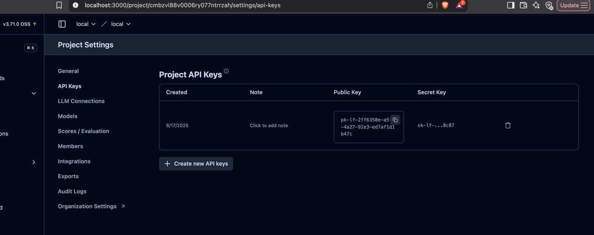
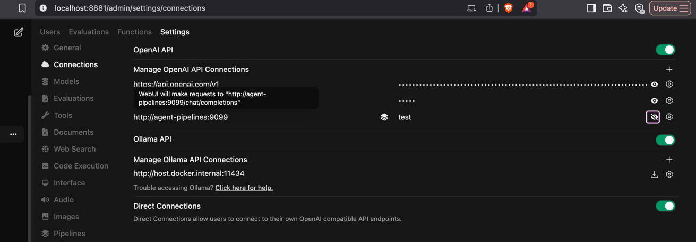

# Finmars AI Assistant - Development Guide

This guide provides detailed instructions for setting up and running the Finmars AI Assistant project locally for development purposes.

## Table of Contents
- [Prerequisites](#prerequisites)
- [Initial Setup](#initial-setup)
- [Running Components](#running-components)

## Prerequisites

Before starting, ensure you have the following installed:

- **Python 3.12+** - Required for the agent and tools
- **Docker Desktop** - For running Open WebUI and Langfuse
- **Git** - For version control
- **A code editor** (VS Code, PyCharm, etc.)

### Required API Keys

You'll need the following API keys:
- **Finmars API Token** - Access to Finmars Portfolio API
- **OpenAI API Key** - For LLM functionality (or compatible provider)
- **Langfuse Keys** (optional) - For observability

## Initial Setup

### 1. Clone the Repository

```bash
git clone git@git.finmars.com:Koriakov/finmars-ai-assistant.git
cd finmars-ai-assistant
```

### 2. Create Python Virtual Environment

```bash
# Create virtual environment (or use conda whatever you want)
python -m venv venv

# Activate virtual environment
# On macOS/Linux:
source venv/bin/activate

# On Windows:
venv\Scripts\activate
```

### 3. Install Dependencies

```bash
pip install -r requirements.txt
```

### 4. Configure Environment Variables

```bash
# Copy the example environment file
cp .env.example .env

# Edit .env with your actual values
# Required variables:
FINMARS_EXPERT_TOKEN=your-finmars-api-token
FINMARS_BASE_URL=https://eu-central.finmars.com
FINMARS_REALM=your-realm
FINMARS_SPACE=your-space

OPENAI_API_KEY=your-openai-api-key
# Optional: Use a different OpenAI-compatible endpoint
# OPENAI_BASE_URL=https://api.openai.com/v1

# Langfuse configuration (!!! CHECK 1.1 Create Langfuse Keys and setup in .env (.env.docker) step below)
LANGFUSE_PUBLIC_KEY=your-public-key
LANGFUSE_SECRET_KEY=your-secret-key
LANGFUSE_HOST=http://localhost:3000

# For Open WebUI integration
PIPELINES_API_KEY=your-pipelines-key
```

## Running Components

### 1. Start Docker Services (Observability & UI)

```bash
# Start all Docker services in the background
docker-compose --env-file .env.docker up -d

# Verify all services are running
docker-compose ps

# View logs if needed
docker-compose logs -f
```

This starts:
- **Open WebUI** at http://localhost:8881
- **Langfuse** at http://localhost:3000
- Supporting databases (PostgreSQL, ClickHouse, Redis, MinIO)

### 1.1 Create Langfuse Keys and setup in .env (.env.docker)


### 1.2 Setup agent-pipelines Connection service in Open-WebUI service


### 1.3 Restart docker-compose.yaml
```bash
docker-compose --env-file .env.docker up -d
```

### 2. Run the ReAct Agent

The main agent can be run directly:

```bash
python agents/react_agent/runner.py
```

Example interactions:
```python
# The agent will start and wait for input
# Try queries like:
# - "List all portfolios"
# - "Show me portfolios of type HEDGE_FUND"
# - "Get portfolio with ID 123"
# - "What portfolio types are available?"
```

### 3. Access Web Interfaces

- **Open WebUI**: http://localhost:8881
  - Default login: Create an account on first access
  - Configure to use your agent endpoint

- **Langfuse**: http://localhost:3000
  - View traces of agent executions
  - Manage prompts
  - Analyze performance

В конфлюенс:
1. Настойка других провайдеров llm (deepseek, ollama etc)